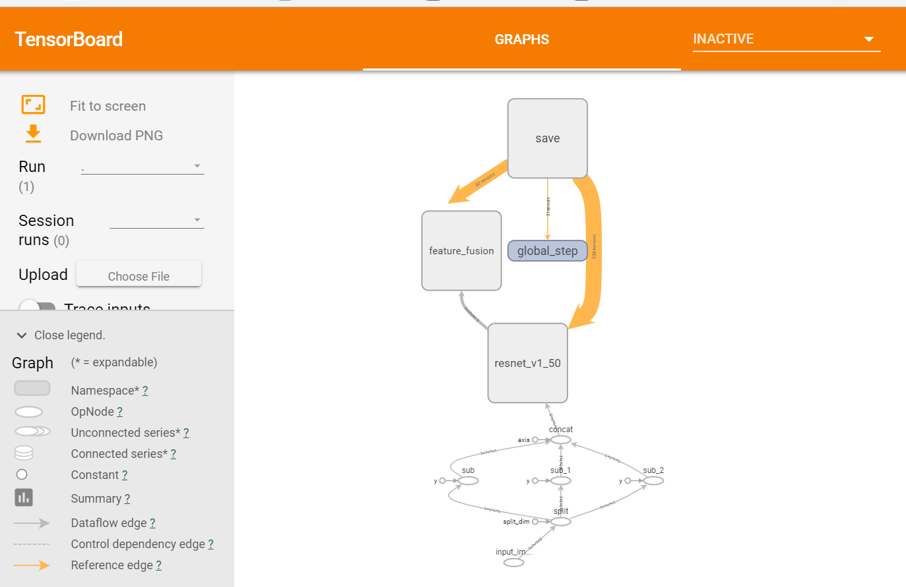

# EAST: An Efficient and Accurate Scene Text Detector - see readme.md.org

Here is to introduce for how to generate the frozen model file from the pretrained model
 
 ### Download
   Models trained on ICDAR 2013 (training set) + ICDAR 2015 (training set): [BaiduYun link](http://pan.baidu.com/s/1jHWDrYQ) [GoogleDrive](https://drive.google.com/open?id=0B3APw5BZJ67ETHNPaU9xUkVoV0U)

 ### Run
    # python3 export_model.py east_icdar2015_resnet_v1_50_rbox/model.ckpt-49491.meta           east_icdar2015_resnet_v1_50_rbox/model.ckpt-49491
    # python3 ../tf_src/tensorflow/tensorflow/python/tools/freeze_graph.py --input_graph=./output_model/pb_model/model.pb --input_checkpoint east_icdar2015_resnet_v1_50_rbox/model.ckpt-49491 --output_graph=./output_model/pb_model/model_frozen.pb --output_node_names=feature_fusion/concat_3

   > The feature_fusion/concat_3 is the last layer which is defined in model.py.
   > It can also be found by using tensorboard tool
   # tensorboard --logdir ./logs/
   

